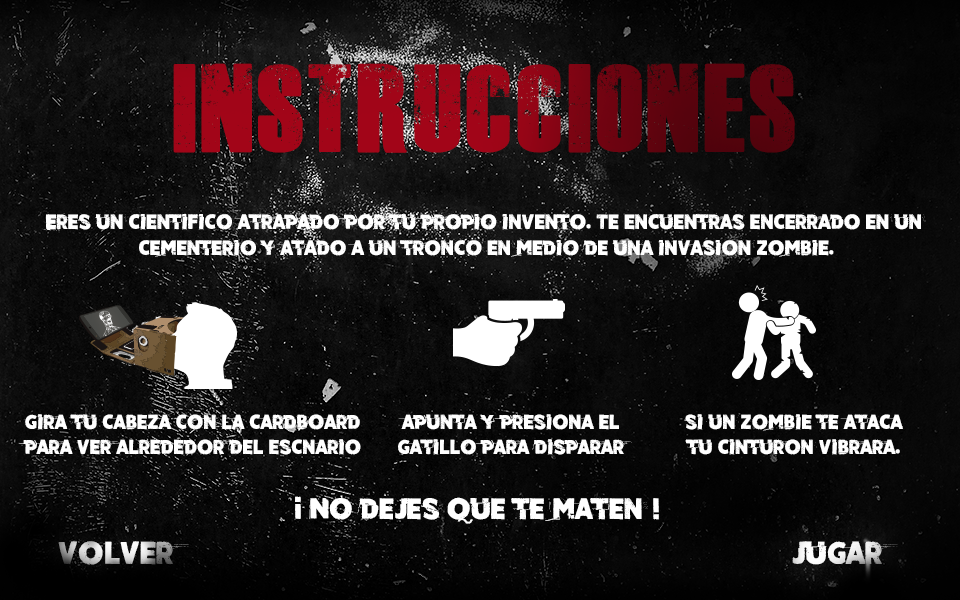

# dead-return
virtual reality video game developed in unity, you must survive to a zombie attack !  take your glasses and your vr gum and lets shot 

View the following YouTube videos for more information
*  [demo](https://www.youtube.com/watch?v=fZ2syEHD1Uo)
*  [teaser and history I](https://www.youtube.com/watch?v=wkNFdhfN_jY)
*  [teaser and history II](https://www.youtube.com/watch?v=DYd7K8FBAH4)
*  [some character renders](https://www.youtube.com/watch?v=QbAuPtMMfc0)

  
  

  
   

  
  
  

  

to know all about Dead Return, visit our website, there are all documentation about the video game, development process,
story, characters, users tests, code, the virtual reality system, and detailed  information about the project.

http://deadreturnco.wixsite.com/deadreturn

Thanks very much.